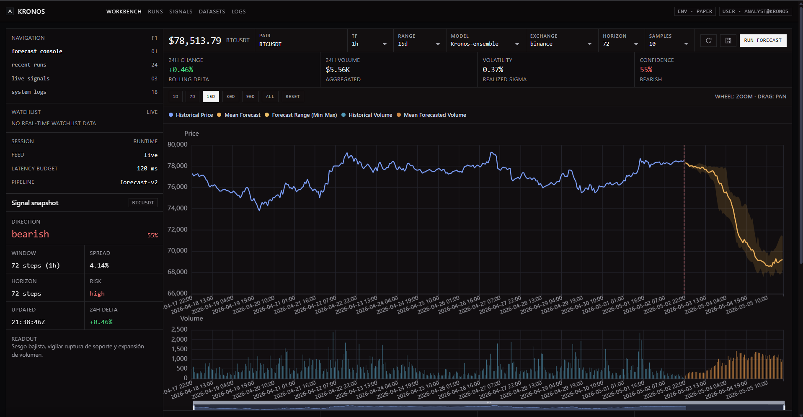

# Kronos WebUI

Terminal-style UI for Kronos forecasting with a real FastAPI backend, Dockerized deployment, probabilistic inference, and replayable saved runs.

## Dashboard



## Features

- Real market history from `Yahoo Finance` + `Binance` fallback.
- Kronos model execution:
  - `Kronos-small`
  - `Kronos-base`
  - `Kronos-ensemble`
- Probabilistic forecast bands (`p10 / p50 / p90`) from stochastic sampling.
- Adjustable runtime controls:
  - pair (`BTCUSDT`, etc.)
  - timeframe
  - range
  - horizon
  - sample runs
  - model
  - exchange mode
- Live progress terminal while inference runs.
- Manual `Save` flow for clean `Saved runs` (no auto-save spam).
- Replay any saved run on the main chart with updated historical context.

## Stack

- Frontend: static `index.html` (dark terminal-style UI)
- Backend: `FastAPI`
- Forecast engine: official Kronos models
- Storage: SQLite (`./data/runs.sqlite3`, persistent volume)
- Deployment: Docker Compose

## Run

```bash
docker compose up -d --build
```

## Access

- App: `http://<SERVER_IP>:18080`
- Health: `http://<SERVER_IP>:18080/api/health`

## Core API

- `POST /api/forecast` - forecast response
- `POST /api/forecast/stream` - live progress stream + result
- `POST /api/runs/save` - manual save current forecast
- `GET /api/runs` - list saved runs
- `GET /api/runs/{id}` - replay saved run

Example:

```bash
curl -X POST http://127.0.0.1:18080/api/forecast \
  -H 'content-type: application/json' \
  -d '{
    "pair": "BTCUSDT",
    "timeframe": "1h",
    "history": "15d",
    "model": "Kronos-base",
    "exchange": "auto",
    "horizon_steps": 24,
    "sample_runs": 7
  }'
```

## Notes

- First run can be slower due to model warm-up.
- Higher `sample_runs` means better probabilistic stability but much higher latency.
- Data persistence is volume-backed (`./data`) so saved runs survive container rebuilds.
